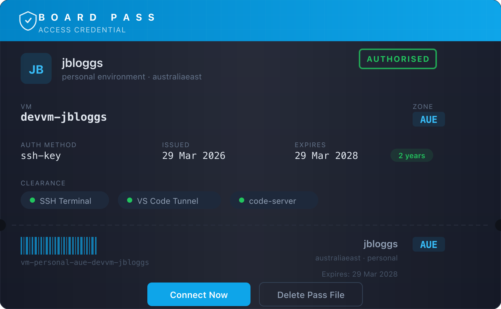

  

# Board

One-click connection to your Board cloud dev environment.

## Quick Start

Your admin sent you a **`.board-pass`** file and a **passphrase**.

1. **Cmd+Shift+P** > `Board: Import Pass` > select the file > enter the passphrase
2. Click **Connect Now** on the board pass card
3. You're coding on your cloud VM

The extension handles SSH keys, config, and connection automatically.

## After Connecting

On first connect you'll be prompted to run **first-time setup** (Git identity + SSH keys).

Your VM has a sample project at `~/projects/hello-board` — try `docker compose up` and visit `http://localhost:8000`.

## Commands

### VS Code (Cmd+Shift+P)

| Command | What it does |
|---|---|
| `Board: Import Pass` | Decrypt and install a `.board-pass` file |
| `Board: Connect` | Open a remote VS Code window on your VM |
| `Board: Start` | Start your VM (requires Azure CLI) |
| `Board: Stop` | Deallocate your VM (saves costs) |
| `Board: Run First-Time Setup` | Configure Git identity + SSH keys on the VM |
| `Board: Open code-server` | Open code-server in your browser |
| `Board: Open Terminal` | SSH terminal to your VM |
| `Board: Open Workspace Terminals` | Standard terminal + Copilot split layout |
| `Board: Open in Azure Portal` | Jump to the VM in the Azure portal |
| `Board: Cheatsheet` | Open the full quick-reference cheatsheet |
| `Board: Configure Connection (Advanced)` | Manual setup (admins) |

### On the VM (Terminal)

| Command | What it does |
|---|---|
| `check` | Run all health checks (Docker, services, ports) |
| `board-help` | Show the on-VM quick reference |
| `gs` | `git status` |
| `gd` | `git diff` |
| `gl` | `git log --oneline -20` |
| `dc up` | `docker compose up` |
| `dc down` | `docker compose down` |
| `dc logs -f` | Follow container logs |
| `dc ps` | List running containers |
| `systemctl --user restart <svc>` | Restart a project service |
| `journalctl --user -u <svc> -f` | Stream service logs |

**Tip:** Use **Ctrl+Shift+P > Run Task** in VS Code to see project-specific tasks without memorising service names.

## Sidebar

The Board activity bar icon gives you:

- **Board Status** — live VM state, IP, FQDN, size
- **Quick Actions** — Connect, Start/Stop, Setup, Browser IDE
- **Cheatsheet** — categorised quick reference for all commands

## Access Methods

| Method | Client | Extensions | Auth |
|---|---|---|---|
| VS Code Desktop + SSH | VS Code + Board extension | Full Microsoft Marketplace | SSH key |
| code-server | Any modern browser | Open VSX | Password |

## Key Paths on the VM

| Path | What's there |
|---|---|
| `~/projects/` | Your project workspace (you start here) |
| `~/.board/` | Board config, health scripts |

## Daily Workflow

**Morning:** Click **Board: Connect** (or click the status bar). If your VM is stopped, it starts automatically.

**During the day:** Code normally. Run `check` if something feels off.

**Evening:** VMs auto-shutdown at 7 PM to save costs. Your files, Docker volumes, and git state all persist — just reconnect tomorrow.

## Troubleshooting

| Problem | Fix |
|---|---|
| Can't connect | Check the status bar — is the VM running? Try **Board: Start** |
| Services unhealthy | Run `check`, then `systemctl --user restart <svc>` |
| Docker issues | `dc down && dc up` to restart all containers |
| Git auth issues | Run **Board: Run First-Time Setup** again |
| Need a fresh start | Ask your admin to reprovision |

## Don't have a board pass?

Ask your admin. They'll create one with `just export-pass <yourname>`.
